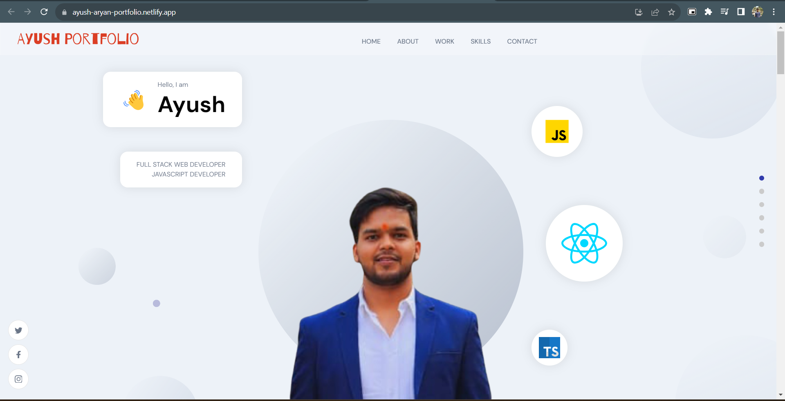

## Description

This project showcases my portfolio in a structured manner, highlighting various works I've done. It provides details about each work along with associated images, descriptions, and links.

## Table of Contents
# Features
# Technologies Used
# Getting Started
# Usage
# Contributing
# License
# Features
Display a portfolio of works
Filter works by categories such as UI/UX, Web App, Mobile App, React JS, etc.
Showcase multiple images for each work using a slideshow on hover
Direct links to project and code repositories
## Technologies Used
React.js
Framer Motion (for animations)
Sanity (for backend data management)
Other libraries or technologies you've utilized
## Getting Started
Prerequisites
Node.js installed
Sanity Studio set up with required schemas and data
## Installation
Clone the repository.
Navigate to the project directory.
Run npm install to install dependencies.
## Configuration
Set up Sanity Studio with required schemas and populate data.
## Usage
Start the development server using npm start.
Access the project on localhost:3000 in your browser.
## Contributing
Contributions are welcome! If you find any bugs or have suggestions for improvements, please create an issue or submit a pull request.

## License
This project is licensed under the MIT License.